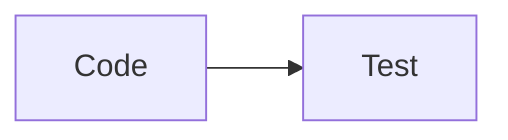

# Credit Scoring – End-to-End ML Pipeline

## Purpose

An end-to-end machine learning solution for loan default risk prediction. This project features a modular pipeline allowing dynamic data ingestion (varying combinations of source tables), customizable feature engineering, and model selection, all deployed on Hugging Face Spaces.

## Data & Architecture

The system is built to handle three relational data sources, enabling flexible training configurations:

- **Apps:** Primary application data (train/test).
- **Bureau:** External historical credit data.
- **Previous_App:** History of past loan applications.

## Key Features

* **Dynamic Training Pipelines:** Users can trigger training runs using different data combinations (Apps only, Apps + Bureau, or all three sources).
* **Modular Preprocessing:** Custom preprocessing logic and feature engineering strategies are mapped to specific data configurations.
* **Model Agnostic:** The architecture supports training and comparing multiple model architectures (e.g., XGBoost, LightGBM, Random Forest).
* **Robust Feature Selection:** Implemented a stability-based feature ranking strategy using repeated LightGBM training across multiple folds and random seeds. Feature importance scores are aggregated to identify consistently informative variables and reduce model complexity without significantly impacting predictive performance.
* **MLflow Tracking:** All experiments—including data versions, hyperparameters, and model artifacts—are logged in MLflow for full reproducibility and auditing.
* **CI/CD Integration:** Automated workflows ensure code quality and seamless deployment updates.
* **Interactive Web UI:** Built with **Streamlit** for real-time model inference and experiment visualization.
* **API-First Design:** Backend powered by **FastAPI** to handle heavy lifting and model inference requests.
* **Deployment:** Fully deployed on **Hugging Face Spaces**, leveraging Docker for consistent environments.

## Tech Stack

* **Frameworks:** FastAPI (Backend), Streamlit (Frontend).
* **ML Ops:** MLflow (Experiment tracking & Model Registry).
* **CI/CD:** GitHub Actions (Automated testing & deployment).
* **Data Handling:** Pandas, Scikit-Learn for dynamic preprocessing.
* **Hosting:** Hugging Face Spaces (Docker-based environment).

## Pipeline Flow

1. **Config Selection:** Via the UI/API, choose the data sources to include.
2. **Dynamic Preprocessing:** The pipeline detects input sources and applies the appropriate feature engineering modules.
3. **Training & Tracking:** Models are trained and logged via **MLflow**, tracking every iteration of the dynamic pipeline.
4. **CI/CD Deployment:** Merging to the main branch triggers GitHub Actions, which builds the image and updates the **Hugging Face Space**.
5. **Inference:** The FastAPI backend serves the latest model, while the Streamlit UI provides a user-friendly interface for manual testing.

## Challenges & Solutions

* **Data Complexity:** Managing varying schemas across 6+ CSVs was solved by implementing a centralized schema mapper.
* **Dynamic Pipelines:** Used factory patterns to instantiate the correct feature engineering classes based on the chosen input sources.
* **Model Explainability:** Initial feature engineering generated more than 600 variables, making business interpretation difficult. A robust feature selection framework based on repeated LightGBM importance rankings was implemented, reducing the final model to approximately 20 key variables with minimal performance degradation.
* **Reproducibility:** MLflow was integrated to solve the "lost experiment" problem, allowing us to compare performance between different data combinations (e.g., Apps vs. Apps+Bureau).
* **Deployment Constraints:** Optimized the Docker environment for Hugging Face Spaces to ensure fast cold-starts while handling model loading for large datasets.