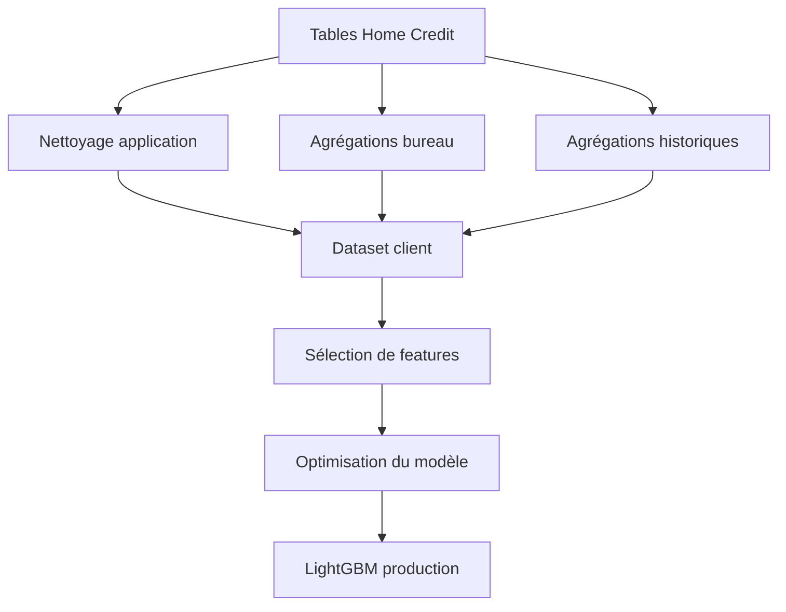

# Conception du modèle

<div style="padding: 1rem 1.25rem; border-left: 0.28rem solid #448aff; background: rgba(68, 138, 255, 0.10); border-radius: 0.25rem; font-size: 1.08rem; line-height: 1.5;">
Le travail modèle vise un résultat <strong>simple à servir</strong> : 20 variables finales, un seuil métier, un LightGBM packagé.
</div>

## Préparation des données

[](https://pandas.pydata.org/)
[](https://numpy.org/)



## Arbitrages importants

- Les tables brutes sont ramenées au niveau **client `SK_ID_CURR`**.
- Le pipeline crée des variables métier : ratios crédit/revenu, paiement, retards, historiques.
- La sélection réduit **plus de 600 variables** à **20 features** pour simplifier le serving.
- Le seuil est choisi avec un **business score** qui pénalise fortement les faux négatifs.

## Entraînement et suivi

[](https://lightgbm.readthedocs.io/)
[](https://mlflow.org/)
[](https://scikit-learn.org/)

| Élément | Rôle |
| --- | --- |
| `config/training.yaml` | Reproduire les expériences |
| MLflow | Tracer paramètres, métriques et seuil |
| LightGBM | Modèle retenu pour production |
| ONNX | Version optimisée pour benchmark |

## Sortie modèle

```json
{
  "probability": 0.1842,
  "prediction": "Not likely to default"
}
```

??? info "Annexes"

    ## Données utilisées

    - Tables principales : `application_train` et `application_test`.
    - Crédits externes : `bureau` et `bureau_balance`.
    - Historiques précédents : `previous_application`, `installments_payments`, `POS_CASH_balance`, `credit_card_balance`.

    ## Préprocessing détaillé

    - Nettoyage de valeurs métier comme `DAYS_EMPLOYED = 365243` et `CODE_GENDER = XNA`.
    - Encodage ordinal du niveau d'études et one-hot encoding des autres catégories.
    - Création de ratios métier : `PAYMENT_RATE`, revenu/crédit, revenu/personne.
    - Agrégations par client : moyennes, sommes, variances, séparation `Active` / `Closed`.
    - Fusion finale de toutes les sources dans un dataset tabulaire client.

    ## Entraînement

    - Plusieurs familles de modèles peuvent être comparées : LightGBM, XGBoost, CatBoost, Random Forest, régression logistique, baseline dummy.
    - Les importances LightGBM sont stabilisées sur plusieurs folds et plusieurs seeds.
    - Le modèle final est tuné avec `RandomizedSearchCV` sur le coût métier.
    - Le seuil de décision est optimisé sur calibration.
