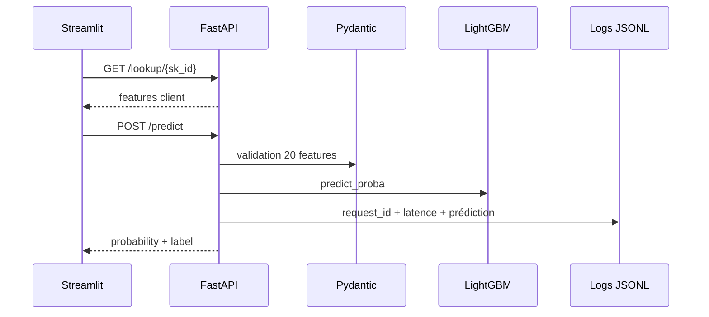

# API FastAPI

<div style="padding: 1rem 1.25rem; border-left: 0.28rem solid #448aff; background: rgba(68, 138, 255, 0.10); border-radius: 0.25rem; font-size: 1.08rem; line-height: 1.5;">
L'API transforme le modèle en <strong>service HTTP testable, documenté et observable</strong>.
</div>

## Schéma d'appel

[](https://fastapi.tiangolo.com/)
[](https://docs.pydantic.dev/)



- `Pydantic` verrouille les entrées : types, catégories et valeurs manquantes.
- Les erreurs sont explicites : `422`, `404`, `500`.
- Les logs alimentent ensuite l'onglet monitoring.

| Route | Rôle dans la démo |
| --- | --- |
| `/docs` | Contrat Swagger |
| `/lookup/{sk_id}` | Préremplir un client |
| `/reference` | Alimenter les distributions |
| `/model-info` | Récupérer le seuil |
| `/predict` | Retourner score et décision |

## Démo

!!! tip "Démo à ouvrir"
    Lancer l'API avec **`just api`**, puis ouvrir :

    - **Swagger** : [http://localhost:8000/docs](http://localhost:8000/docs)
    - **API FastAPI** : [http://localhost:8000](http://localhost:8000)
    - **Endpoint `/predict`** : [http://localhost:8000/predict](http://localhost:8000/predict)

??? info "Annexes"

    ## Logs produits

    - Un middleware, ou couche intermédiaire, intercepte chaque requête HTTP avant et après son traitement par l’endpoint.
    - Les appels HTTP gardent méthode, route, statut, latence, erreur et `request_id`.
    - Chaque prédiction garde inputs, probabilité, label, succès/erreur, latence, temps d'inférence, CPU et mémoire.
    - Le format `JSONL` écrit une ligne JSON par événement.

    ## Gestion des erreurs

    - Erreur de validation : `422`.
    - Client absent : `404`.
    - Erreur de prédiction : `500`.
    - Le header `X-Request-Id` permet de corréler réponse client et logs serveur.

    ```json
    {
      "detail": "Prediction failed",
      "request_id": "..."
    }
    ```

    ## Test rapide en ligne de commande

    ```bash
    curl -X POST "http://localhost:8000/predict" \
      -H "Content-Type: application/json" \
      -d '{"EXT_SOURCE_2": 0.62, "AMT_ANNUITY": 35698.5, "PAYMENT_RATE": 0.0276}'
    ```
