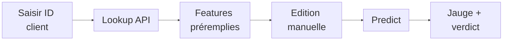

# Application Prédiction

L'application Streamlit rend le modèle <strong>manipulable par un utilisateur métier</strong> : charger, modifier, prédire, comparer.

## Parcours utilisateur

## Ce que l'app apporte

- Les 20 features sont regroupées par **thème métier**.
- Les noms techniques sont remplacés par des labels plus lisibles.
- Les mini-distributions situent le client face à la référence.
- La jauge montre la probabilité, le seuil et la décision.

## Lien avec l'API

| Endpoint | Usage dans l'app |
| --- | --- |
| `/lookup/{sk_id}` | Charger un client |
| `/reference` | Comparer aux distributions |
| `/model-info` | Afficher le seuil |
| `/predict` | Calculer la décision |

## Démo

!!! tip "Démo à ouvrir"
    Lancer l'application avec **`just dashboard`**, puis ouvrir :

    - **Application Streamlit - Prédiction** : [http://localhost:8501](http://localhost:8501)

    --> chargement d'un client, modification d'une feature, nouvelle prédiction.

??? info "Annexes"

    ## Affichage détaillé

    - Les features sont organisées par thèmes : scores externes, profil, prêt, remboursement, crédit, carte bancaire.
    - Les catégories sont décodées pour afficher genre et niveau d'études en clair.
    - Les valeurs sont reformatées avant l'envoi API : entiers, flottants et valeurs manquantes.
    - La session Streamlit conserve les features éditées entre deux actions.

    ## Comportement API côté app

    - `/lookup/{sk_id}` préremplit les données client.
    - `/reference` alimente les mini-distributions de comparaison.
    - `/model-info` fournit le seuil de décision.
    - `/predict` recalcule le score après édition.
    - Le cache Streamlit évite de recharger seuil, référence et graphes à chaque action.
