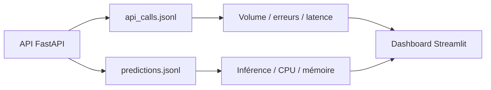
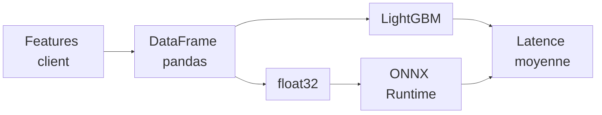

# Application Monitoring

Le monitoring répond à trois questions : <strong>l'API répond-elle ? les données dérivent-elles ? l'inférence coûte-t-elle cher ?</strong>

## 1. Supervision de l'API

| Signal | Source |
| --- | --- |
| Latence par route | Middleware FastAPI |
| Volume / erreurs | `logs/api_calls.jsonl` |
| Inference ms | `logs/predictions.jsonl` |
| CPU / mémoire | `psutil` |

Les courbes runtime sont **lissées par moyenne mobile** pour rendre la tendance lisible en démo.

## 2. Dérive et qualité

- `reference.parquet` sert de population de référence.
- `test.parquet` sert de jeu courant de comparaison.
- Evidently génère les rapports `drift_report.html` et `quality_report.html`.

## 3. Profiling et benchmark

- `cProfile` identifie les fonctions Python les plus coûteuses.
- Le benchmark compare LightGBM standard et ONNX sur 100 inférences.
- Les métriques clés sont moyenne, P95, P99, speedup.

## Démo

!!! tip "Démo à ouvrir"
    Lancer l'application avec **`just dashboard`**, puis ouvrir :

    - **Application Streamlit - Pilotage** : [http://localhost:8501](http://localhost:8501)

    --> latence API, coûts runtime, rapport Evidently, benchmark ONNX.

??? info "Annexes"

    ## Supervision API

    | Indicateur | Rôle |
    | --- | --- |
    | Latence moyenne | Temps moyen par route |
    | Nb erreurs | Nombre de réponses HTTP en erreur |
    | Volume | Nombre d'appels |
    | Courbe de latence | Évolution temporelle par route |
    | Temps d'inférence | Coût modèle mesuré sur `/predict` |
    | CPU / mémoire | Ressources runtime collectées avec `psutil` |

    ## Dérive et qualité

    - Les catégories sont décodées avant rapport pour rester lisibles.
    - Evidently utilise Wasserstein pour les numériques et PSI pour les catégorielles.
    - Les rapports HTML sont générés puis affichés dans Streamlit.

    ## Profiling et benchmark

    - Le profiling lance 50 inférences sur un client de référence.
    - `cProfile` mesure les appels Python ; `pstats` trie les fonctions par temps propre.
    - Le benchmark lance 100 inférences par moteur.
    - Un warm-up écarte le coût d'initialisation.
    - Les métriques suivies sont moyenne, P95, P99, speedup et inférences/seconde.
