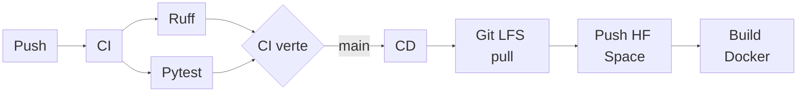

# CI/CD et Déploiement

La chaîne CI/CD garantit que l'application est <strong>testée, packagée et déployée de façon reproductible</strong>.

## Workflow

| Brique | Rôle |
| --- | --- |
| Ruff + Pytest | Bloquer les régressions |
| Dockerfile | Regrouper API, Streamlit, modèle et DB |
| Git LFS | Fournir les artefacts lourds au déploiement |
| Hugging Face Spaces | Héberger l'application publique |

## Docker local

- `Dockerfile` lance API FastAPI + interface Streamlit dans le même conteneur.
- `docker-compose.yml` sert au test local complet avant déploiement.

## Démo

!!! tip "Démo à ouvrir"
    Ouvrir les pages externes :

    - **Runs GitHub Actions** : [https://github.com/olivierbinder/Credit_scoring/actions](https://github.com/olivierbinder/Credit_scoring/actions)
    - **Space Hugging Face** : [https://huggingface.co/spaces/Benderrrrr/credit-scoring](https://huggingface.co/spaces/Benderrrrr/credit-scoring)

??? info "Annexes"

    ## CI

    - La CI se lance à chaque `push`.
    - GitHub Actions installe `uv` avec cache activé.
    - Ruff vérifie le code avec `ruff check src/ tests/`.
    - Le formatage est contrôlé avec `ruff format --check src/ tests/`.
    - Pytest valide les tests unitaires et API.

    ## CD et Docker

    - La CD attend une CI verte sur `main`.
    - `workflow_dispatch` permet un redéploiement manuel.
    - Le Dockerfile part de `python:3.12-slim`.
    - Les ports `8000` et `7860` exposent FastAPI et Streamlit.
    - Hugging Face reconstruit l'image après le push vers le Space.

    ## Git LFS

    - Les données locales et caches restent exclus du dépôt.
    - `.gitattributes` redirige les artefacts lourds vers LFS : `*.parquet`, `*.pkl`, `*.onnx`.
    - La CD exécute `git lfs pull` pour récupérer les vrais fichiers lourds.
