# Structure du dépôt et synthèse finale

<div style="padding: 1rem 1.25rem; border-left: 0.28rem solid #448aff; background: rgba(68, 138, 255, 0.10); border-radius: 0.25rem; font-size: 1.08rem; line-height: 1.5;">
Le dépôt traduit les étapes du projet : <strong>données → modèle → API → interface → monitoring → déploiement</strong>.
</div>

## Vue rapide

### Données et modèle

```text
credit-scoring/
|-- data/raw/                 # tables Home Credit
|-- data/processed/           # df_proc, reference, test
|-- data/feature_selection/   # ranking et subset de variables
|-- config/training.yaml
`-- mlflow.db / mlruns        # suivi des expériences
```

### Application

```text
src/credit_scoring/
|-- features/                 # preprocessing
|-- models/                   # training, tuning, évaluation
|-- serving/                  # API, schemas, inference
|   |-- model/                # model.pkl, model.onnx, MLmodel
|   `-- db/                   # reference.parquet, test.parquet
`-- interfaces/               # app Streamlit, prédiction, monitoring
```

### Exploitation

```text
credit-scoring/
|-- logs/                     # api_calls.jsonl, predictions.jsonl
|-- reports/                  # drift_report.html, quality_report.html
|-- tests/                    # preprocessing, API, inference
|-- Dockerfile
|-- docker-compose.yml
`-- docs/                     # support de soutenance
```

## Schéma final

```mermaid
%%{init: {"themeVariables": {"fontSize": "25px"}, "flowchart": {"nodeSpacing": 50, "rankSpacing": 65, "arrowMarkerAbsolute": true}} }%%
flowchart LR
    subgraph DATA["<b>1. Données et features</b>"]
        direction TB
        RAW["data/raw - CSV Home Credit"]
        PREP["features/preprocess.py<br/>préparation tabulaire"]
        PROC["data/processed - df_proc.parquet"]
        SELECT["feature_selection.py<br/>20 features"]
        FSOUT["data/feature_selection<br/>ranking + subsets"]
        RAW --> PREP --> PROC --> SELECT --> FSOUT
    end

    subgraph TRAIN["<b>2. Entraînement et artefacts</b>"]
        direction TB
        CFG["config/training.yaml"]
        TRAINPIPE["training_pipeline.py<br/>CV + seuil"]
        MLFLOW["MLflow<br/>runs + métriques"]
        MODEL["serving/model<br/>model.pkl + MLmodel"]
        ONNX["model.onnx"]
        CFG --> TRAINPIPE
        TRAINPIPE --> MLFLOW
        TRAINPIPE --> MODEL
        MODEL --> ONNX
    end

    subgraph DB["<b>3. Base de serving</b>"]
        direction TB
        GENBASE["generate_base_for_inference.py"]
        REF[(reference.parquet<br/>base clients)]
        TEST[(test.parquet<br/>comparaison)]
        GENBASE --> REF
        GENBASE --> TEST
    end

    subgraph API["<b>4. API de prédiction</b>"]
        direction TB
        SCHEMAS["schemas.py<br/>Pydantic"]
        INFER["inference.py<br/>lookup + predict"]
        FASTAPI["api.py - FastAPI routes"]
        LOGS[(logs/*.jsonl<br/>exploitation)]
        SCHEMAS --> FASTAPI
        INFER --> FASTAPI --> LOGS
    end

    subgraph UI["<b>5. Interfaces Streamlit</b>"]
        direction TB
        APP["interfaces/app_streamlit.py"]
        SCORING["scoring.py<br/>prédiction client"]
        MONITOR["monitoring.py<br/>logs + drift + ONNX"]
        REPORTS["reports/*.html"]
        APP --> SCORING
        APP --> MONITOR
        MONITOR --> REPORTS
    end

    subgraph OPS["<b>6. Qualité et déploiement</b>"]
        direction TB
        TESTS["tests<br/>features + API"]
        CI["GitHub Actions<br/>ruff + pytest"]
        DOCKER["Dockerfile<br/>app + modèle + DB"]
        COMPOSE["docker-compose.yml<br/>test local"]
        HF["Hugging Face Space<br/>sdk: docker"]
        TESTS --> CI --> DOCKER
        DOCKER --> COMPOSE
        DOCKER --> HF
    end

    PROC --> TRAINPIPE
    FSOUT --> TRAINPIPE
    PROC --> GENBASE
    MODEL --> INFER
    REF --> INFER
    TEST --> MONITOR
    FASTAPI --> SCORING
    LOGS --> MONITOR
    REF --> MONITOR
    ONNX --> MONITOR
    MODEL --> DOCKER
    REF --> DOCKER
    TEST --> DOCKER
    APP --> DOCKER
    FASTAPI --> DOCKER

    classDef data fill:#E8F5E9,stroke:#2E7D32,color:#1B5E20
    classDef train fill:#FFF3E0,stroke:#EF6C00,color:#4E342E
    classDef db fill:#E3F2FD,stroke:#1565C0,color:#0D47A1
    classDef api fill:#E0F2F1,stroke:#00897B,color:#004D40
    classDef ui fill:#FCE4EC,stroke:#C2185B,color:#880E4F
    classDef ops fill:#EDE7F6,stroke:#5E35B1,color:#311B92
    classDef logs fill:#ECEFF1,stroke:#546E7A,color:#263238
    classDef parquet fill:#90CAF9,stroke:#0D47A1,color:#0D47A1,stroke-width:2px
    classDef modelArtifact fill:#FFB74D,stroke:#E65100,color:#3E2723,stroke-width:2px
    classDef logArtifact fill:#B0BEC5,stroke:#37474F,color:#263238,stroke-width:2px
    classDef reportArtifact fill:#F8BBD0,stroke:#AD1457,color:#4A0028,stroke-width:2px

    class RAW,PREP,PROC,SELECT,FSOUT data
    class CFG,TRAINPIPE,MLFLOW,MODEL,ONNX train
    class GENBASE,REF,TEST db
    class SCHEMAS,INFER,FASTAPI api
    class APP,SCORING,MONITOR,REPORTS ui
    class TESTS,CI,DOCKER,COMPOSE,HF ops
    class LOGS logs
    class PROC,REF,TEST parquet
    class MODEL,ONNX modelArtifact
    class LOGS logArtifact
    class REPORTS reportArtifact
```




## Merci

Merci pour votre attention.

??? info "Annexes"

    ## Fichiers racine

    - `pyproject.toml` : dépendances, groupes `ci` / `dev` et configuration Pytest.
    - `uv.lock` : versions figées pour reproduire l'environnement.
    - `Justfile` : raccourcis `api`, `dashboard`, `train`, `test`, Docker et docs.
    - `zensical.toml` : navigation et configuration de la documentation.

    ## Scripts utiles

    - `generate_base_for_inference.py` : génère les bases `reference` et `test`.
    - `export_onnx.py` : exporte le modèle optimisé ONNX.
    - `run_ft_selection_nb.py` et `run_ft_selection_ranking.py` : sélection et ranking des variables.

    ## Artefacts de production

    - `serving/model/model.pkl` : LightGBM de production.
    - `serving/model/model.onnx` : version utilisée pour le benchmark ONNX Runtime.
    - `serving/db/reference.parquet` : base de référence pour lookup et monitoring.
    - `serving/db/test.parquet` : échantillon courant pour comparaison dérive / qualité.
    - `logs/*.jsonl` : événements d'exploitation.
    - `reports/*.html` : rapports Evidently affichés dans l'interface.
