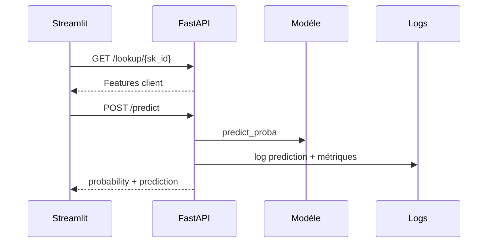

# API FastAPI

## Rôle de l'API

- Exposer le modèle comme un service.
- Valider les entrées avec Pydantic.
- Retourner une probabilité et une décision.
- Journaliser les appels pour alimenter le monitoring.
- Documenter les routes et les erreurs dans Swagger.

## Routes principales

| Route | Méthode | Rôle |
|---|---:|---|
| `/` | GET | Health check |
| `/model-info` | GET | Seuil optimisé du modèle |
| `/lookup/{sk_id}` | GET | Features d'un client connu |
| `/reference` | GET | Données de référence en parquet |
| `/predict` | POST | Score et décision de défaut |

## Schéma d'appel



## Gestion des erreurs

- Les erreurs HTTP utilisent un format commun.
- Les erreurs de validation retournent un `422`.
- Les clients absents retournent un `404`.
- Les erreurs serveur retournent un `500` avec un `request_id`.

```json
{
  "detail": "Prediction failed",
  "request_id": "..."
}
```

## Swagger

- Disponible sur `/docs`.
- Permet de tester `/predict` directement depuis le navigateur.
- Documente les modèles de réponse et les cas d'erreur.

## Exemple de prédiction

```bash
curl -X POST "https://<space-url>/predict" \
  -H "Content-Type: application/json" \
  -d '{"EXT_SOURCE_2": 0.62, "...": "..."}'
```

Réponse attendue :

```json
{
  "probability": 0.1842,
  "prediction": "Not likely to default"
}
```

## Points à montrer

- Ouvrir `/docs` et montrer Swagger.
- Appeler `/model-info`.
- Appeler `/lookup/{sk_id}`.
- Faire une prédiction.
- Vérifier ensuite que l'appel apparaît dans l'onglet monitoring.
