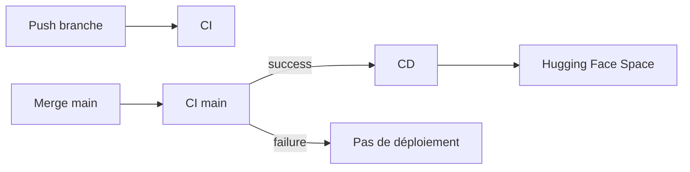

# CI/CD

## Objectif

- Valider automatiquement le code.
- Eviter de déployer une version non testée.
- Déployer sur Hugging Face Spaces après succès de la CI sur `main`.

## Workflow CI

La CI se déclenche à chaque `push`.

Jobs :

- **lint** :
  - installation des dépendances CI avec `uv` ;
  - `ruff check src/ tests/` ;
  - `ruff format --check src/ tests/`.
- **test** :
  - installation du projet avec le groupe CI ;
  - exécution de `pytest`.

## Workflow CD

La CD ne part pas directement sur chaque branche.

- Elle écoute la fin du workflow `CI`.
- Elle ne déploie automatiquement que sur `main`.
- Elle vérifie que la conclusion de la CI est `success`.
- Elle peut aussi être lancée manuellement avec `workflow_dispatch`.

## Gestion des fichiers lourds

- Les modèles et fichiers parquet sont suivis avec Git LFS.
- Le workflow CD checkout les fichiers LFS.
- Un `git lfs pull` explicite évite les objets manquants au push vers HF.

## Points à montrer

- Le fichier `.github/workflows/ci.yml`.
- Le fichier `.github/workflows/cd.yml`.
- Un run CI avec les jobs `lint` et `test`.
- Un run CD déclenché après CI verte sur `main`.
- Le commit déployé vers le Space Hugging Face.
