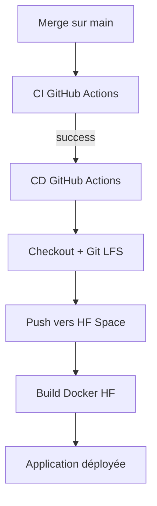

# Docker et Hugging Face Spaces

## Objectif

- Fournir un environnement reproductible.
- Lancer l'API FastAPI et l'application Streamlit dans le même conteneur.
- Déployer l'ensemble sur Hugging Face Spaces avec le SDK Docker.

## Dockerfile

Points importants :

- image de base `python:3.12-slim` ;
- installation de `uv` ;
- installation des dépendances depuis `pyproject.toml` et `uv.lock` ;
- copie du code source, de la config, des rapports et des logs ;
- exposition des ports `8000` et `7860`.

Commande de lancement :

- FastAPI démarre sur le port `8000` ;
- Streamlit démarre sur le port `7860`.

## Hugging Face Spaces

Le README conserve le front matter attendu par Hugging Face :

```yaml
---
title: Credit Scoring
emoji: 📊
sdk: docker
---
```

Le Space construit l'image Docker puis sert l'application Streamlit.

## Déploiement



## Points d'attention

- Le modèle et les parquets sont versionnés avec Git LFS.
- Le push vers HF doit avoir accès aux vrais fichiers, pas seulement aux
  pointeurs LFS.
- Le déploiement est volontairement simple : un seul conteneur pour l'API et
  l'interface.
