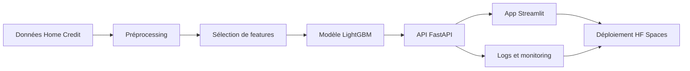

# Contexte de la mission

## Objectif métier

- Estimer le risque de défaut d'un demandeur de crédit.
- Transformer un modèle entraîné en service exploitable.
- Montrer une chaîne MLOps cohérente, de la conception à l'exploitation.

## Périmètre du projet

- **Modèle** : classifier LightGBM sélectionné comme modèle de production.
- **API** : service FastAPI pour exposer la prédiction.
- **Interface** : application Streamlit pour tester un client et piloter le système.
- **Monitoring** : logs API, dérive des données, qualité, latence et benchmark ONNX.
- **Déploiement** : image Docker publiée sur Hugging Face Spaces via GitHub Actions.

## Fil conducteur de la soutenance

## Message important

- Le projet ne cherche pas à livrer une plateforme complète de retraining.
- La partie training reste configurable par code et YAML.
- L'application déployée se concentre sur le modèle final, son usage et son
  pilotage.

## Ce que l'examinateur doit voir

- Une prédiction réalisée via l'application et via l'API.
- Une documentation Swagger exploitable.
- Des logs et indicateurs de supervision.
- Des rapports de dérive et qualité générés avec Evidently.
- Une CI qui valide le code et une CD qui déploie après succès sur `main`.
