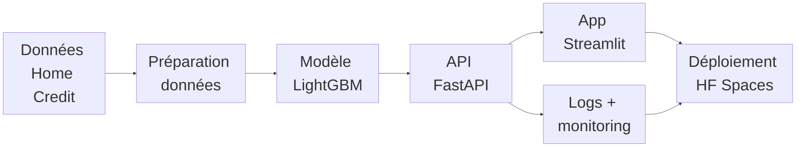

# Contexte de la mission

Transformer un <strong>modèle de prédiction</strong> de risque de défaut d'un demandeur de crédit en <strong>application exploitable</strong>.

## Schéma général

## Stack MLOps

