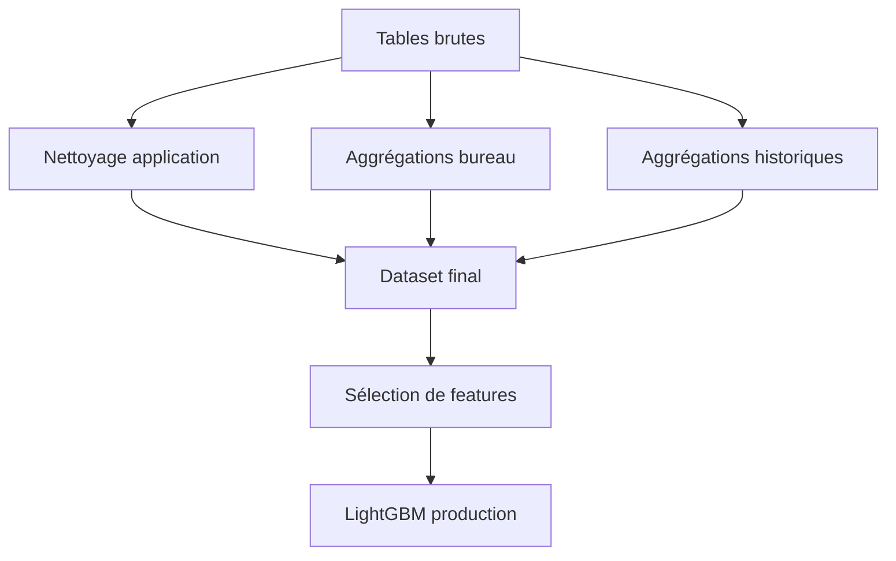

# Conception du modèle

## Données utilisées

- Données principales de demande de crédit : `application_train` et
  `application_test`.
- Historique de crédit externe : `bureau` et `bureau_balance`.
- Historique des crédits précédents : `previous_application`,
  `installments_payments`, `POS_CASH_balance` et `credit_card_balance`.

## Préprocessing

- Nettoyage des valeurs métier particulières, par exemple `DAYS_EMPLOYED`.
- Encodage des variables catégorielles.
- Agrégation des tables historiques au niveau `SK_ID_CURR`.
- Création de ratios simples, comme `PAYMENT_RATE`.
- Fusion finale des sources dans un dataset tabulaire.



## Sélection de features

- Le pipeline initial produit beaucoup de variables.
- Une sélection robuste est calculée avec plusieurs folds et plusieurs seeds.
- Les importances LightGBM sont agrégées pour classer les variables.
- Le modèle servi utilise un ensemble réduit de 20 variables.

## Entraînement

- La configuration principale est dans `config/training.yaml`.
- Le pipeline entraîne le modèle, optimise le seuil et loggue les résultats.
- MLflow conserve les paramètres, métriques, artifacts et seuil optimal.
- Plusieurs modèles sont instanciables côté code : LightGBM, XGBoost, CatBoost,
  Random Forest, régression logistique et baseline dummy.

## Modèle retenu

- Le modèle de production déployé est un **LightGBM**.
- La décision est basée sur une probabilité et un seuil optimisé.
- La sortie reste simple pour l'usage métier :

```json
{
  "probability": 0.1842,
  "prediction": "Not likely to default"
}
```

## Limites assumées

- L'application Streamlit ne permet pas de choisir un modèle ou de relancer un
  entraînement.
- Le serving est construit autour du modèle packagé dans `serving/model`.
- Le retraining reste une étape technique, lancée depuis le code ou le Justfile.
