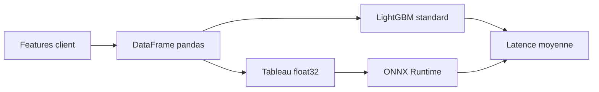

# Application Monitoring

## Objectif

- Suivre le comportement de l'API.
- Vérifier la stabilité des données.
- Mesurer le coût d'inférence.
- Comparer le modèle standard avec la version ONNX.

L'onglet **Pilotage** de Streamlit centralise ces vues.

## 1. Supervision de l'API

- Les appels HTTP sont loggés dans `logs/api_calls.jsonl`.
- Le dashboard filtre les routes métier :
  - `/lookup/{sk_id}` ;
  - `/model-info` ;
  - `/predict` ;
  - `/reference`.
- Les routes techniques comme `/docs` ou `/openapi.json` sont masquées.

Indicateurs affichés :

| Indicateur | Rôle |
|---|---|
| Latence moyenne | Temps moyen par route |
| Nb erreurs | Nombre de réponses HTTP en erreur |
| Volume | Nombre d'appels |
| Courbe de latence | Evolution temporelle par route |

## 2. Dérive et qualité des données

- Les rapports sont générés avec **Evidently**.
- La référence est `serving/db/reference.parquet`.
- Les données de comparaison sont `serving/db/test.parquet`.
- Les variables catégorielles sont décodées avant affichage.

Rapports disponibles :

- `reports/drift_report.html` ;
- `reports/quality_report.html`.

## 3. Profiling d'inférence

- L'application lance 50 inférences sur un exemple de référence.
- `cProfile` identifie les fonctions les plus coûteuses.
- Le résultat est affiché sous forme de tableau.

Points observés :

- coût des conversions `pandas` ;
- coût des appels modèle ;
- coût du chemin d'inférence complet, pas seulement `predict_proba`.

## 4. Benchmark LightGBM vs ONNX

Métriques affichées :

- latence moyenne ;
- P95 ;
- P99 ;
- accélération moyenne ;
- ordre de grandeur théorique en inférences/seconde.

## Message clé

- Le monitoring couvre à la fois l'exploitation API et la stabilité des données.
- Le benchmark ONNX montre une piste concrète d'optimisation de la latence.
- Tout est visible dans l'application, sans outil externe pendant la démo.
