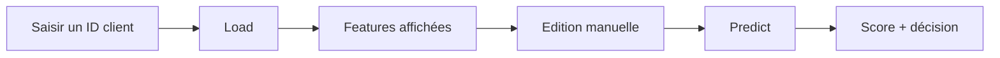

# Application Prédiction

## Objectif

- Offrir une interface simple pour tester le modèle.
- Charger un client depuis l'API.
- Modifier les 20 features du modèle final.
- Visualiser les valeurs par rapport aux distributions de référence.
- Lancer une prédiction et afficher le résultat.

## Parcours utilisateur

## Ce qui est affiché

- Les features sont regroupées par thème :
  - scores externes ;
  - profil du demandeur ;
  - caractéristiques du prêt ;
  - historique de remboursement ;
  - historique de crédit ;
  - utilisation carte de crédit.
- Les variables catégorielles sont remappées en valeurs lisibles.
- Les distributions permettent de comparer le client à la population de référence.
- Les valeurs numériques sont formatées pour éviter les décimales inutiles.

## Interaction avec l'API

- `/lookup/{sk_id}` récupère les données du client.
- `/reference` fournit les données utilisées pour les graphiques.
- `/model-info` fournit le seuil de décision.
- `/predict` calcule le score après édition éventuelle des features.

## Résultat de prédiction

- La jauge affiche la probabilité de défaut.
- Le seuil optimisé sépare les zones de décision.
- Le verdict indique si le client est considéré comme risqué ou non.

## Limites assumées

- L'interface ne permet pas de sélectionner un autre modèle.
- L'interface ne lance pas de retraining.
- Les features affichées correspondent au modèle final packagé.

## Points à montrer

- Charger un client existant.
- Modifier une valeur simple.
- Montrer les mini-distributions.
- Lancer une prédiction.
- Revenir ensuite au monitoring pour montrer les logs générés.
