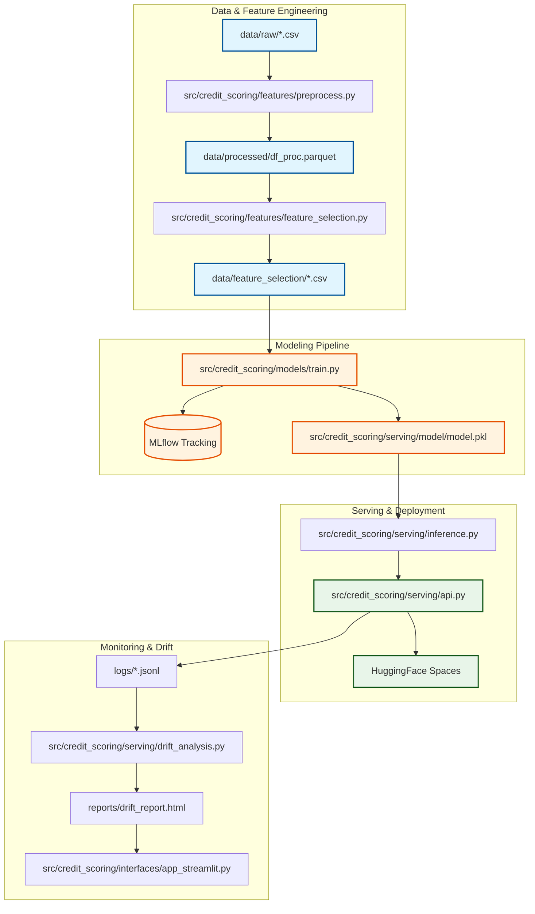

# Workflow

```mermaid
graph TD
    %% Couche Data
    subgraph Data_Layer [Data & Feature Engineering]
        Raw[data/raw/*.csv] --> Preproc[src/credit_scoring/features/preprocess.py]
        Preproc --> Proc[data/processed/df_proc.parquet]
        Proc --> FS[src/credit_scoring/features/feature_selection.py]
        FS --> Feat[data/feature_selection/*.csv]
    end

    %% Couche Modélisation
    subgraph Training_Layer [Modeling Pipeline]
        Feat --> Train[src/credit_scoring/models/train.py]
        Train --> MLflow[(MLflow Tracking)]
        Train --> Model[src/credit_scoring/serving/model/model.pkl]
    end

    %% Couche Déploiement & Serving
    subgraph Serving_Layer [Serving & Deployment]
        Model --> Inference[src/credit_scoring/serving/inference.py]
        Inference --> API[src/credit_scoring/serving/api.py]
        API --> HuggingFace[HuggingFace Spaces]
    end

    %% Couche Monitoring
    subgraph Monitoring_Layer [Monitoring & Drift]
        API --> Logs[logs/*.jsonl]
        Logs --> Drift[src/credit_scoring/serving/drift_analysis.py]
        Drift --> Report[reports/drift_report.html]
        Report --> Streamlit[src/credit_scoring/interfaces/app_streamlit.py]
    end

    %% Styles
    classDef data fill:#e1f5fe,stroke:#01579b,stroke-width:2px;
    classDef model fill:#fff3e0,stroke:#e65100,stroke-width:2px;
    classDef deploy fill:#e8f5e9,stroke:#1b5e20,stroke-width:2px;

    class Raw,Proc,Feat data;
    class Train,Model,MLflow model;
    class API,HuggingFace deploy;

```
